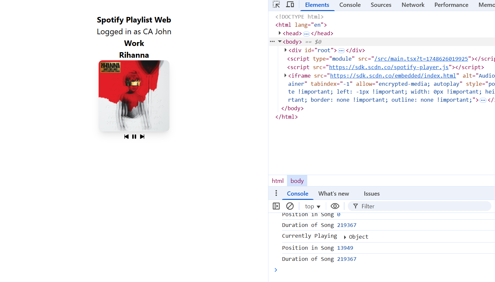

## Spotify Web Player

-Note: You will need to set your own API CLIENT_ID through Spotify API platform

-SPAC music player using spotify api

#### Features
- **Authentication**: authentication done
- **Intuitive UI**: basic UI implemented for Forward, PlayPause, Back using reacticons library
- **PKCE**: designed to prevent CSRF attacks between the client<->server

#### Technologies
React, Tailwind

